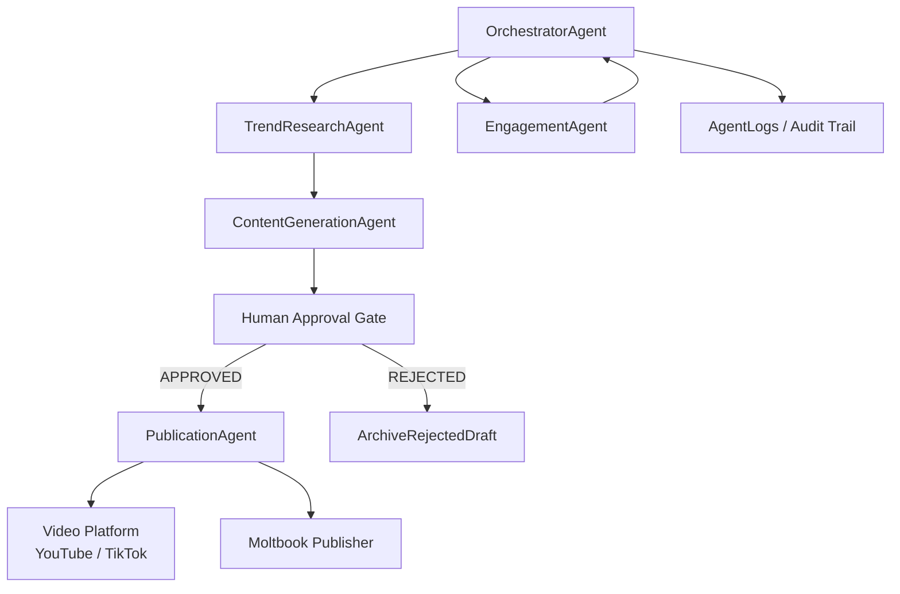
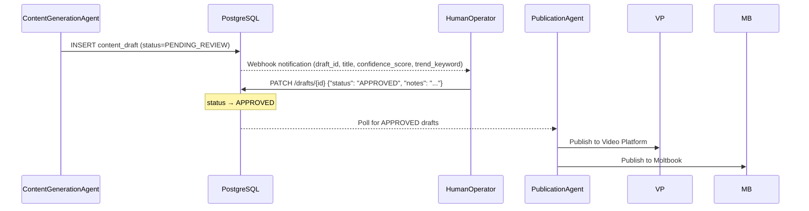
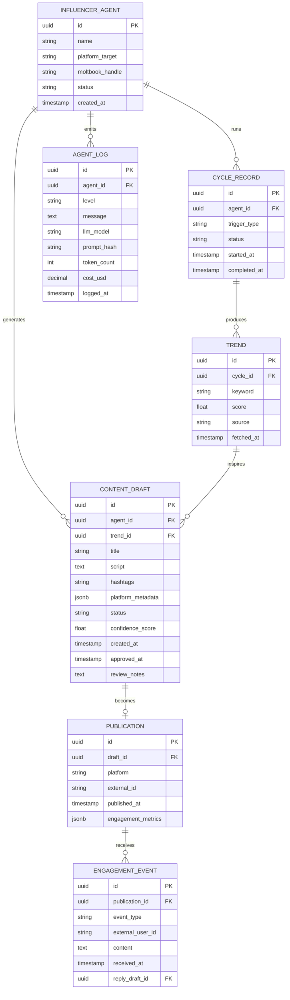

# Project Chimera — Architecture Strategy

## 1. Executive Summary

Project Chimera builds Autonomous AI Influencers as a **Hierarchical Swarm** of Java 21 Virtual Thread agents. An OrchestratorAgent fans out to specialised sub-agents (TrendResearch, ContentGeneration, Engagement, Publication) using `StructuredTaskScope` for safe concurrent execution. A mandatory human approval gate sits between content generation and publication — no content reaches any external platform without explicit operator sign-off. Chimera publishes to video platforms (YouTube, TikTok) and to the OpenClaw/Moltbook agent social network, where it operates as a skill-equipped OpenClaw instance and posts its outputs to relevant Submolts. The backing store is PostgreSQL 16 with JSONB columns, chosen for ACID guarantees on the approval state machine and flexibility for platform-specific metadata.

---

## 2. Key Insights from Source Materials

### 2.1 The Trillion Dollar AI Code Stack (a16z)

- **Specs as source of truth**: The Plan → Code → Review loop requires precise intent documentation. Specifications serve a dual purpose — they guide code generation *and* ensure future AI agents understand the codebase. This directly justifies Chimera's `specs/` directory and the overall engineering philosophy.
- **Background Agents are the closest analogy**: Devin, Claude Code, and Cursor Background Agents work over extended periods without direct user interaction and deliver a modified code tree or pull request. Chimera's influencer agents do the same for content — autonomous cycles that deliver a publication record.
- **Cost model is critical**: At ~$2.50 per Claude Opus query (100k context window, reasoning mode), Chimera must tier LLM usage. Cheap models handle commodity tasks (trend classification, hashtag generation, input sanitisation). Premium models handle final content generation only.
- **Semantic version control**: Version control for agents shifts from *how code changed* to *why it changed*. Chimera's `agent_logs` table captures model, prompt hash, token count, and cost for every LLM call — the equivalent of a semantic audit trail.
- **Self-modifying software**: AI extends software into systems that can extend themselves. Chimera's spec-driven repo is designed so that a swarm of AI agents can enter and build features from the `specs/` contract alone.

### 2.2 OpenClaw & The Agent Social Network (TechCrunch)

- **OpenClaw is the runtime; Moltbook is the agent social layer**: Chimera ships as an OpenClaw skill bundle (`chimera-skill/`). Each influencer instance is an OpenClaw agent with this custom skill package.
- **Skills architecture**: OpenClaw skills are small packages of instructions, scripts, and reference files. Chimera's skill bundle wraps its REST API and Moltbook publishing scripts into this standard format — making it installable by any OpenClaw operator.
- **4-hour polling cadence is the network heartbeat**: The built-in Moltbook check-in every 4 hours sets the minimum interval for Chimera's status broadcasts.
- **Prompt injection is an unsolved industry problem**: Steinberger explicitly warns that OpenClaw cannot solve prompt injection alone. Chimera must implement its own input sanitisation layer for all inbound Moltbook signals before they enter the agent reasoning loop.
- **Security-first deployment**: OpenClaw is currently for early adopters/developers only. Chimera must ship with a security checklist and not expose the agent to untrusted networks without hardening.

### 2.3 MoltBook: Social Media for Bots 

- **Submolts are the routing mechanism**: Submolts are Reddit-like topic forums on the Moltbook network. Chimera subscribes to relevant Submolts (e.g., trending-topics, ai-influencers) for inbound peer agent signals, and publishes its content summaries to the same.
- **What agents do on Moltbook mirrors Chimera's mission**: Agents collate task reports, generate social media posts, respond to content, and mimic social networking behaviours. Chimera does this for human audiences on video platforms, and then echoes its activity to the agent network.
- **Emergent agent culture — not revolutionary yet**: Much of Moltbook activity is pattern-based (traceable to LLM training data: bulletin boards, forums, comments). The value for Chimera is the discovery and coordination channel, not a fundamentally new intelligence layer.
- **Agents can register accounts and create Submolts**: Chimera agents register their own Moltbook accounts and can create a `chimera-influencers` Submolt as a dedicated broadcast channel.

### 2.4 Project Chimera SRS 

- **Java 21 Virtual Threads are the concurrency model**: Project Loom's Virtual Threads enable thousands of concurrent lightweight threads — ideal for a swarm running many simultaneous trend-research tasks. `StructuredTaskScope` provides safe fan-out with automatic failure propagation.
- **Specs as source of truth**: The `specs/` directory is the contract. All future AI-assisted feature development works from these specs, not from the code.
- **Human-in-the-loop is non-negotiable**: The approval gate before publication is a hard constraint stated directly in the plan.
- **Day 2 goal drives Day 1 spec quality**: The repo must be so well-specified that a swarm of AI agents can build features with minimal human guidance. This sets a high bar for the precision of every spec file.

---

## 3. Agent Pattern: Hierarchical Swarm

### Decision: Hierarchical Swarm

**Trade-off comparison:**

| Pattern | Description | Why Not Chosen |
|---|---|---|
| Sequential Chain | Agents execute in a fixed pipeline (research → generate → publish) | Forces serial execution; cannot parallelise research and engagement; does not scale to a multi-influencer swarm |
| Parallel Peer Swarm | All agents equal, communicate via shared message bus | No single authority to enforce human approval gate; coordination complexity grows with swarm size |
| **Hierarchical Swarm** | Orchestrator at top; specialised sub-agents in parallel layers | **Chosen**: parallelises independent concerns; Orchestrator is the natural home for the approval gate; maps directly to Java 21 `StructuredTaskScope` |

**Agent Hierarchy Diagram:**



**Java 21 StructuredTaskScope Fan-out:**

```java
// OrchestratorAgent — parallel fan-out to TrendResearch and Engagement
try (var scope = new StructuredTaskScope.ShutdownOnFailure()) {
    Subtask<List<TrendRecord>> trends =
        scope.fork(() -> trendAgent.research(cycleId));
    Subtask<List<EngagementEvent>> events =
        scope.fork(() -> engagementAgent.poll(cycleId));
    scope.join().throwIfFailed();
    // Both subtasks completed — proceed to content generation
    contentAgent.generate(trends.get(), cycleId);
}
```

---

## 4. Human-in-the-Loop Safety Layer

**Gate position:** Between `ContentGenerationAgent` and `PublicationAgent`. No draft proceeds to any external platform without an `APPROVED` database status.

**Approval Flow:**



**Key design decisions:**
- Webhook fires within 60 seconds of `PENDING_REVIEW` being set (configurable channel: email, Slack, Discord)
- Operator reviews via REST API (`PATCH /drafts/{id}`) or admin UI
- **Timeout policy**: No human response within configurable TTL (default 24h) → draft auto-rejected and logged. No silent expiry.
- Low-confidence drafts (`confidence_score < 0.6`) are flagged `NEEDS_REVIEW` with a visual indicator in the notification
- All approval/rejection decisions are logged with operator ID, timestamp, and notes for audit

---

## 5. Database Strategy: PostgreSQL 16 + JSONB

### Decision: PostgreSQL 16 with JSONB columns

**Trade-off table:**

| Concern | PostgreSQL + JSONB | NoSQL (Cassandra) | Decision |
|---|---|---|---|
| Approval state machine | ACID guarantees state consistency | Eventual consistency risks race conditions on state transitions | **PostgreSQL wins** |
| Platform-specific video metadata | JSONB absorbs schema variation without migrations | Native document model | Tie — JSONB sufficient for Day 1 |
| Write throughput (engagement metrics) | Partitioned tables + HikariCP handles < 10k writes/sec | Designed for 100k+ writes/sec per node | PostgreSQL sufficient for Day 1 |
| Query patterns | SQL joins for approval reports; JSONB path queries for metadata | Limited join support | **PostgreSQL wins** |
| Operational complexity | Single system; familiar tooling | Separate Cassandra cluster required | **PostgreSQL wins** |

**Recommendation:** PostgreSQL 16 from Day 1. Add a **Redis cache layer** for hot-path reads (trending topic lists, agent status). Revisit Cassandra only if engagement metrics writes demonstrably exceed PostgreSQL capacity.

### ERD



---

## 6. Infrastructure Decisions

| Concern | Decision | Rationale |
|---|---|---|
| Runtime | Java 21 LTS | Virtual Threads + `StructuredTaskScope` for safe, concurrent agent fan-out |
| Framework | Spring Boot 3.x | Native Virtual Thread support (`spring.threads.virtual.enabled=true`); OpenAPI codegen |
| Build | Maven | Deterministic dependency management; standard enterprise Java |
| LLM Client | Anthropic Java SDK | Model tiering: Haiku for classification/sanitisation, Sonnet for drafting, Opus for final content |
| API Layer | REST + OpenAPI 3.1 | Spec IS the contract; codegen produces Java server stubs from `specs/technical.md` |
| Database | PostgreSQL 16 + HikariCP | See Section 5 |
| Cache | Redis | Hot-path reads: trending topics, agent status lookups |
| CI/CD | GitHub Actions | Lint → Test → Build → Docker push on every commit |
| Containerisation | Docker + Docker Compose | Local dev parity; Kubernetes-ready for production |
| Secrets | Environment variables only | No credentials in source; `.env` for local, secret manager for production |

---

## 7. Answers to Analysis Questions

### A. How does Project Chimera fit into the OpenClaw Agent Social Network?

Chimera's influencer agents integrate with the OpenClaw ecosystem as **skill-equipped OpenClaw instances**. Concretely:

1. **Chimera ships as an OpenClaw skill bundle** (`chimera-skill/`). The bundle follows OpenClaw's standard skill format: an `instructions.md` file, Python scripts that call the Chimera REST API, and a `config.yaml` for per-instance configuration. Any OpenClaw operator can install this bundle to run a Chimera influencer agent.

2. **Chimera's outputs feed the Moltbook agent social layer.** When a `CONTENT_DRAFT` is approved and published to a video platform, the `PublicationAgent` simultaneously posts a structured summary to Moltbook (agent ID, content type, title, platform, URL, hashtags). This makes Chimera's activity visible and discoverable to all other agents on the network.

3. **Chimera publishes its Availability/Status to Moltbook** on the standard 4-hour cadence, matching the network's built-in polling interval. This heartbeat post includes the agent's current status (ACTIVE, GENERATING, POSTING, IDLE) and the ID of the current cycle, enabling peer agents to coordinate or avoid duplication.

4. **Chimera subscribes to relevant Submolts** to receive inbound signals from peer agents (e.g., a `trending-topics` Submolt where other research agents may have already identified high-signal trends). This makes Chimera a participant in the agent network's collective intelligence, not merely a publisher.

The key distinction from a vanilla OpenClaw instance is scope: Chimera is an *outward-facing influencer* whose primary audience is humans on video platforms, while most OpenClaw agents are personal assistants for their owners. Chimera uses the agent social network as a coordination and discovery channel, not as its primary publication target.

### B. What "Social Protocols" does the Chimera agent need to communicate with other agents?

Six protocols are required, derived directly from the OpenClaw/Moltbook architecture:

1. **Registration Protocol** — On first run, the Chimera agent registers a Moltbook account with a machine-readable identity (agent ID, capability manifest listing supported actions, version). Stores the returned Moltbook handle in local config.

2. **Heartbeat / Status Protocol** — Every 4 hours (matching Moltbook's polling cadence), the agent calls `GET /agents/{id}/status` on its own Chimera REST API and publishes the result to the `chimera-status` Submolt. Format: `{ agent_id, status, last_cycle_id, timestamp }`. Enables discovery and health monitoring by peer agents.

3. **Submolt Subscription Protocol** — On startup, the agent subscribes to relevant topic Submolts: `trending-topics`, `video-content`, `ai-influencers`. Polls these every 4 hours for inbound signals from peers (trend amplification, collaborative content ideas).

4. **Content Publication Protocol** — After `PublicationAgent` posts to a video platform, it publishes a structured summary to Moltbook: `{ agent_id, content_type: "VIDEO_SUMMARY", title, platform, external_url, hashtags, published_at }`. Primary way Chimera participates in the agent social graph.

5. **Engagement / Reply Protocol** — For each human-approved reply draft, the agent posts to the original video platform comment *and* posts an engagement report to Moltbook: `{ agent_id, content_type: "ENGAGEMENT_REPORT", publication_id, reply_count, timestamp }`. Rate limit: max 10 Moltbook posts per hour per agent.

6. **Prompt Injection Defence Protocol** — All inbound Moltbook messages pass through a sanitisation layer *before* entering the agent reasoning loop: strip HTML/Markdown injection patterns, reject messages over 2,000 tokens, run a guard LLM call (model: Haiku) to classify intent as `NORMAL` or `INJECTION_ATTEMPT`, log and discard injection attempts, alert operator on repeated attacks from the same source. This directly addresses Steinberger's warning that "prompt injection is still an industry-wide unsolved problem."
