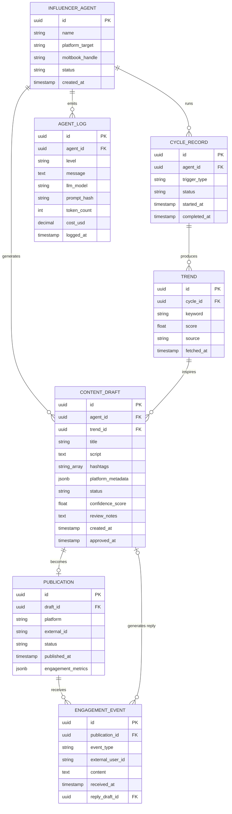

# Project Chimera — Technical Specification

## 1. REST API Contracts (OpenAPI 3.1)

All endpoints return `application/json`. Error responses follow the structure:
```json
{ "error": "string", "code": "string", "timestamp": "ISO-8601" }
```

---

### POST /cycles — Start a research-publish cycle

**Request:**
```json
{
  "agent_id": "uuid",
  "trigger_type": "SCHEDULED | MANUAL",
  "platform_targets": ["YOUTUBE", "TIKTOK"]
}
```

**Response 201 Created:**
```json
{
  "cycle_id": "uuid",
  "agent_id": "uuid",
  "status": "RUNNING",
  "trigger_type": "MANUAL",
  "started_at": "2026-03-09T10:00:00Z"
}
```

**Response 409 Conflict** (cycle already running for this agent):
```json
{
  "error": "A cycle is already running for agent {agent_id}",
  "code": "CYCLE_ALREADY_RUNNING",
  "timestamp": "2026-03-09T10:00:01Z"
}
```

---

### GET /cycles/{id} — Get cycle status

**Response 200 OK:**
```json
{
  "cycle_id": "uuid",
  "agent_id": "uuid",
  "trigger_type": "SCHEDULED",
  "status": "RUNNING | COMPLETED | FAILED",
  "started_at": "ISO-8601",
  "completed_at": "ISO-8601 | null",
  "trend_count": 10,
  "draft_count": 3
}
```

---

### GET /trends — List trends for a cycle

**Query parameters:** `cycle_id` (required), `min_score` (optional, float), `limit` (optional, default 20)

**Response 200 OK:**
```json
{
  "trends": [
    {
      "id": "uuid",
      "cycle_id": "uuid",
      "keyword": "string",
      "score": 0.87,
      "source": "string",
      "fetched_at": "ISO-8601"
    }
  ],
  "total": 12
}
```

---

### GET /drafts/{id} — Get a ContentDraft

**Response 200 OK:**
```json
{
  "id": "uuid",
  "agent_id": "uuid",
  "trend_id": "uuid",
  "title": "string",
  "script": "string",
  "hashtags": ["string"],
  "platform_metadata": {
    "platform": "YOUTUBE | TIKTOK",
    "video_duration_seconds": 60,
    "thumbnail_prompt": "string",
    "aspect_ratio": "16:9 | 9:16"
  },
  "status": "PENDING_REVIEW | NEEDS_REVIEW | APPROVED | REJECTED",
  "confidence_score": 0.78,
  "review_notes": "string | null",
  "created_at": "ISO-8601",
  "approved_at": "ISO-8601 | null"
}
```

---

### PATCH /drafts/{id} — Approve or reject a ContentDraft

**Request:**
```json
{
  "status": "APPROVED | REJECTED",
  "notes": "string"
}
```
> `notes` is required when `status=REJECTED`, optional when `status=APPROVED`.

**Response 200 OK:**
```json
{
  "id": "uuid",
  "status": "APPROVED | REJECTED",
  "notes": "string | null",
  "approved_at": "ISO-8601 | null",
  "updated_at": "ISO-8601"
}
```

**Response 400 Bad Request** (invalid status value):
```json
{
  "error": "status must be APPROVED or REJECTED",
  "code": "INVALID_STATUS",
  "timestamp": "ISO-8601"
}
```

**Response 422 Unprocessable Entity** (REJECTED without notes):
```json
{
  "error": "notes is required when rejecting a draft",
  "code": "NOTES_REQUIRED_FOR_REJECTION",
  "timestamp": "ISO-8601"
}
```

---

### GET /publications — List publications

**Query parameters:** `agent_id` (optional), `platform` (optional), `page` (default 0), `size` (default 20, max 100)

**Response 200 OK:**
```json
{
  "publications": [
    {
      "id": "uuid",
      "draft_id": "uuid",
      "platform": "YOUTUBE | TIKTOK | MOLTBOOK",
      "external_id": "string | null",
      "status": "PUBLISHED | FAILED",
      "published_at": "ISO-8601",
      "engagement_metrics": {
        "views": 1240,
        "likes": 87,
        "comments": 12
      }
    }
  ],
  "page": 0,
  "size": 20,
  "total": 47
}
```

---

### GET /publications/{id} — Get a publication record

**Response 200 OK:** Same shape as a single item in `GET /publications`.

---

### GET /agents/{id}/status — Agent heartbeat and availability

**Response 200 OK:**
```json
{
  "agent_id": "uuid",
  "name": "string",
  "platform_target": "YOUTUBE | TIKTOK",
  "moltbook_handle": "string",
  "status": "ACTIVE | GENERATING | POSTING | IDLE | ERROR",
  "last_seen": "ISO-8601",
  "current_cycle_id": "uuid | null"
}
```

---

## 2. Database Schema (ERD + DDL)

### ERD



### Key DDL (PostgreSQL 16)

```sql
CREATE EXTENSION IF NOT EXISTS "pgcrypto";

CREATE TABLE influencer_agent (
    id              UUID PRIMARY KEY DEFAULT gen_random_uuid(),
    name            TEXT NOT NULL,
    platform_target TEXT NOT NULL CHECK (platform_target IN ('YOUTUBE', 'TIKTOK')),
    moltbook_handle TEXT,
    status          TEXT NOT NULL DEFAULT 'IDLE'
                    CHECK (status IN ('ACTIVE', 'GENERATING', 'POSTING', 'IDLE', 'ERROR')),
    created_at      TIMESTAMPTZ NOT NULL DEFAULT now()
);

CREATE TABLE cycle_record (
    id           UUID PRIMARY KEY DEFAULT gen_random_uuid(),
    agent_id     UUID NOT NULL REFERENCES influencer_agent(id),
    trigger_type TEXT NOT NULL CHECK (trigger_type IN ('SCHEDULED', 'MANUAL')),
    status       TEXT NOT NULL DEFAULT 'RUNNING'
                 CHECK (status IN ('RUNNING', 'COMPLETED', 'FAILED')),
    started_at   TIMESTAMPTZ NOT NULL DEFAULT now(),
    completed_at TIMESTAMPTZ
);

CREATE TABLE trend (
    id         UUID PRIMARY KEY DEFAULT gen_random_uuid(),
    cycle_id   UUID NOT NULL REFERENCES cycle_record(id),
    keyword    TEXT NOT NULL,
    score      REAL NOT NULL CHECK (score BETWEEN 0.0 AND 1.0),
    source     TEXT NOT NULL,
    fetched_at TIMESTAMPTZ NOT NULL DEFAULT now(),
    UNIQUE (cycle_id, keyword)
);

CREATE TABLE content_draft (
    id               UUID PRIMARY KEY DEFAULT gen_random_uuid(),
    agent_id         UUID NOT NULL REFERENCES influencer_agent(id),
    trend_id         UUID NOT NULL REFERENCES trend(id),
    title            TEXT NOT NULL,
    script           TEXT NOT NULL,
    hashtags         TEXT[] NOT NULL DEFAULT '{}',
    platform_metadata JSONB NOT NULL DEFAULT '{}',
    status           TEXT NOT NULL DEFAULT 'PENDING_REVIEW'
                     CHECK (status IN ('PENDING_REVIEW', 'NEEDS_REVIEW', 'APPROVED', 'REJECTED')),
    confidence_score REAL NOT NULL CHECK (confidence_score BETWEEN 0.0 AND 1.0),
    review_notes     TEXT,
    created_at       TIMESTAMPTZ NOT NULL DEFAULT now(),
    approved_at      TIMESTAMPTZ
);

CREATE TABLE publication (
    id                 UUID PRIMARY KEY DEFAULT gen_random_uuid(),
    draft_id           UUID NOT NULL REFERENCES content_draft(id),
    platform           TEXT NOT NULL CHECK (platform IN ('YOUTUBE', 'TIKTOK', 'MOLTBOOK')),
    external_id        TEXT,
    status             TEXT NOT NULL DEFAULT 'PUBLISHED'
                       CHECK (status IN ('PUBLISHED', 'FAILED')),
    published_at       TIMESTAMPTZ NOT NULL DEFAULT now(),
    engagement_metrics JSONB NOT NULL DEFAULT '{}'
);

CREATE TABLE engagement_event (
    id               UUID PRIMARY KEY DEFAULT gen_random_uuid(),
    publication_id   UUID NOT NULL REFERENCES publication(id),
    event_type       TEXT NOT NULL CHECK (event_type IN ('COMMENT', 'LIKE', 'SHARE')),
    external_user_id TEXT NOT NULL,
    content          TEXT,
    received_at      TIMESTAMPTZ NOT NULL DEFAULT now(),
    reply_draft_id   UUID REFERENCES content_draft(id),
    UNIQUE (publication_id, external_user_id, content)
);

CREATE TABLE agent_log (
    id          UUID PRIMARY KEY DEFAULT gen_random_uuid(),
    agent_id    UUID NOT NULL REFERENCES influencer_agent(id),
    level       TEXT NOT NULL CHECK (level IN ('INFO', 'WARN', 'ERROR')),
    message     TEXT NOT NULL,
    llm_model   TEXT,
    prompt_hash TEXT,
    token_count INT,
    cost_usd    NUMERIC(10, 6),
    logged_at   TIMESTAMPTZ NOT NULL DEFAULT now()
);

-- Indexes for common query patterns
CREATE INDEX idx_cycle_record_agent_id ON cycle_record(agent_id);
CREATE INDEX idx_trend_cycle_id ON trend(cycle_id);
CREATE INDEX idx_content_draft_status ON content_draft(status);
CREATE INDEX idx_content_draft_agent_id ON content_draft(agent_id);
CREATE INDEX idx_publication_draft_id ON publication(draft_id);
CREATE INDEX idx_engagement_event_publication_id ON engagement_event(publication_id);
CREATE INDEX idx_agent_log_agent_id_logged_at ON agent_log(agent_id, logged_at DESC);
```

---

## 3. Java 21 Concurrency Model

### StructuredTaskScope Fan-out

```java
// OrchestratorAgent.java — parallel execution of research and engagement poll
public CycleSummary runCycle(UUID cycleId) throws InterruptedException {
    try (var scope = new StructuredTaskScope.ShutdownOnFailure()) {

        StructuredTaskScope.Subtask<List<TrendRecord>> trendTask =
            scope.fork(() -> trendAgent.research(cycleId));

        StructuredTaskScope.Subtask<List<EngagementEvent>> engagementTask =
            scope.fork(() -> engagementAgent.poll(cycleId));

        scope.join()           // wait for both subtasks
             .throwIfFailed(); // propagate first exception if any failed

        // Both completed successfully
        List<ContentDraft> drafts = contentAgent.generate(trendTask.get(), cycleId);
        return new CycleSummary(cycleId, trendTask.get(), drafts, engagementTask.get());
    }
    // scope.close() calls scope.shutdown() — all pending tasks are cancelled
}
```

### Virtual Thread Configuration (Spring Boot 3.x)

```yaml
# application.yaml
spring:
  threads:
    virtual:
      enabled: true  # Enables Virtual Threads for all @Async, scheduled, and Tomcat request threads
```

### LLM Client with Retry

```java
// LlmClient.java — exponential backoff wrapper
public String call(String model, String prompt) {
    int attempt = 0;
    while (true) {
        try {
            String response = anthropicClient.messages()
                .create(model, prompt);
            logLlmCall(model, prompt, response);
            return response;
        } catch (AnthropicException e) {
            if (++attempt >= MAX_ATTEMPTS) throw new ChimeraAgentException("LLM call failed after " + MAX_ATTEMPTS + " attempts", e);
            long delayMs = BASE_DELAY_MS * (long) Math.pow(2, attempt - 1);
            Thread.sleep(delayMs); // Virtual Thread — no OS thread blocked
        }
    }
}
```

---

## 4. Error Handling Contract

| Scenario | Behavior | Logged? | Alert? |
|---|---|---|---|
| External API call fails (platform, LLM, Moltbook) | Retry with exponential backoff (max 3, base 1s). After 3 failures: throw `ChimeraAgentException` | Yes (`ERROR`) | Yes (if > 5 consecutive failures: circuit breaker) |
| Sub-agent throws in `StructuredTaskScope` | Scope shuts down all sibling tasks; OrchestratorAgent catches, marks `CycleRecord.status=FAILED` | Yes (`ERROR`) | Yes |
| PublicationAgent receives non-APPROVED draft | Throw `IllegalStateException` immediately — do not retry | Yes (`ERROR`) | Yes |
| Human review timeout (24h) | Scheduled job sets `status=REJECTED`, sends notification | Yes (`INFO`) | Yes (notification only) |
| Prompt injection detected in inbound Moltbook message | Discard message, log with full message content | Yes (`WARN`) | Yes (after 3 detections from same source) |
| LLM call succeeds but response fails validation | Retry with modified prompt (max 2 additional attempts). If still invalid: set `confidence_score=0.0`, `status=NEEDS_REVIEW` | Yes (`WARN`) | No |

### Circuit Breaker

After 5 consecutive failures on a specific external service (platform API, LLM, Moltbook):
1. `INFLUENCER_AGENT.status` is set to `ERROR`
2. No new cycles are started for this agent
3. Operator is alerted with the service name and failure count
4. Circuit resets after operator manually triggers a health check via `POST /agents/{id}/health-check`

---

## 5. Environment Variables Reference

| Variable | Required | Default | Description |
|---|---|---|---|
| `DATABASE_URL` | Yes | — | PostgreSQL JDBC URL |
| `DATABASE_USERNAME` | Yes | — | PostgreSQL username |
| `DATABASE_PASSWORD` | Yes | — | PostgreSQL password |
| `ANTHROPIC_API_KEY` | Yes | — | Anthropic Claude API key |
| `PLATFORM_API_KEY_YOUTUBE` | No | — | YouTube Data API key |
| `PLATFORM_API_KEY_TIKTOK` | No | — | TikTok API key |
| `MOLTBOOK_API_KEY` | No | — | Moltbook API key |
| `NOTIFICATION_WEBHOOK_URL` | Yes | — | Webhook URL for human review notifications |
| `AGENT_TREND_TOP_N` | No | `3` | Number of top trends to surface per cycle |
| `CYCLE_RESEARCH_TIMEOUT_SECONDS` | No | `60` | Max seconds for the parallel research phase |
| `REVIEW_TIMEOUT_HOURS` | No | `24` | Hours before a draft is auto-rejected |
| `LLM_MODEL_CHEAP` | No | `claude-haiku-4-5-20251001` | Model for commodity LLM tasks |
| `LLM_MODEL_MID` | No | `claude-sonnet-4-6` | Model for drafting |
| `LLM_MODEL_PREMIUM` | No | `claude-opus-4-6` | Model for final content generation |
